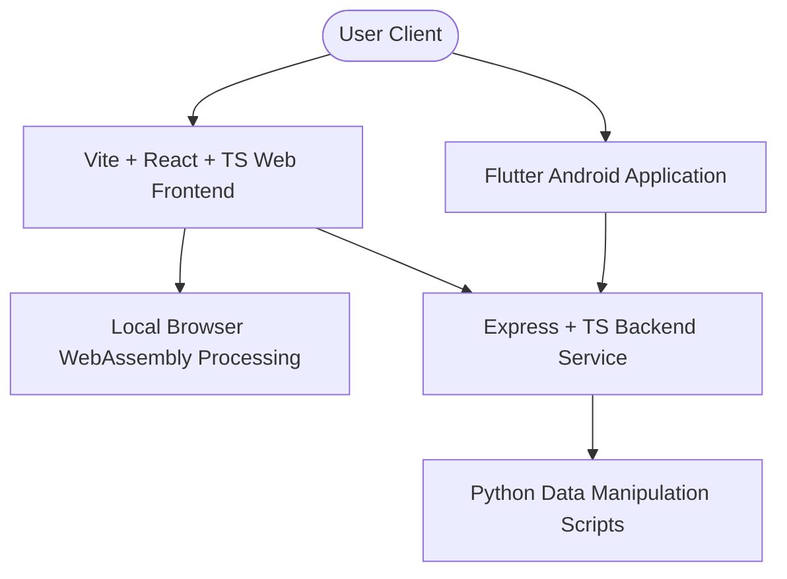

# OmniPDF 🚀

OmniPDF is a premium, next-generation, decentralized suite for PDF editing, compression, conversion, organization, and AI-powered intelligence tools. Built with a decoupled cloud-ready architecture, OmniPDF supports seamless local processing in the browser, an advanced cloud backend for complex tasks, and a companion Android application.

---

## 📱 Android Application (Download Now)

The official OmniPDF Android application brings the same premium document utility features straight to your phone, optimized with a fast tools dashboard, instant search filtering, and custom notifications.

* **Download App (Release APK)**: [Google Drive Download Link](https://drive.google.com/file/d/1pum6bxn_ERFrn64J5wGnx7-tHFBWzUDg/view?usp=sharing)
* **Mobile Features**:
  * Clean tools dashboard with dynamic search filtering.
  * Local tool processing & secure remote integrations.
  * Custom success/error SnackBar overlays with swipe-to-dismiss support.
  * High-speed split-file downloads.

---

## 🛠️ Key Features

### 📂 Organize & Optimize
* **Merge PDF**: Combine multiple PDF files in any order you choose.
* **Split PDF**: Separate pages into standalone documents.
* **Remove Pages**: Instantly discard unnecessary pages from a document.
* **Extract Pages**: Extract target page ranges and save as a clean PDF.
* **Compress PDF**: Highly optimized compression (reducing sizes up to 90% directly in-browser using WebAssembly).

### 🔄 Conversions (To/From PDF)
* **Convert from PDF**: PDF to Word, PDF to PowerPoint, PDF to Excel, PDF to JPG.
* **Convert to PDF**: Word to PDF, PowerPoint to PDF, Excel to PDF, HTML to PDF, JPG to PDF.
* **Scan to PDF**: Transform images/scans directly into compact PDF files.

### 🛡️ Security & Editing
* **Watermark PDF**: Add custom text watermarks with flexible rotation and real-time volume bar style opacity controllers.
* **Rotate PDF**: Fix document alignments.
* **Unlock PDF**: Remove permissions and passwords from encrypted files.
* **Protect PDF**: Add strong password protection using military-grade encryption keys.

### 🧠 PDF Intelligence (AI Tools)
* **AI Summarizer**: Query documents, extract key highlight bullets, and generate summaries using secure language models.
* **OCR PDF**: Convert scanned documents into searchable, editable text PDFs.

---

## 🏗️ Technology Stack



### 1. Web Frontend (`/frontend`)
* **Framework**: React 18 (TypeScript) built with Vite for optimal HMR performance.
* **Styling**: Vanilla CSS with interactive space/mesh gradients, responsive grid card layouts, and animated hover effects.
* **Performance**: WebAssembly integrations for executing heavy compression algorithms locally.
* **Transitions**: Infinite keyframes (`shield-shine`) creating reflective metallic effects across actions.

### 2. Backend Service (`/backend`)
* **Runtime**: Node.js with Express (TypeScript).
* **Script Helpers**: Executing isolated Python controllers (`pdf-helper.py`, `ocr.py`) to manage PDF manipulation.
* **APIs**: Rest endpoints for AI, OCR, security password locking, and conversions.

### 3. Mobile Companion App (`/mobile`)
* **Framework**: Flutter & Dart.
* **Dashboard UI**: Custom SilverGrid layout, real-time search queries, dynamic page route animations, and custom SnackBar alert widgets.

---

## 🚀 Local Development Setup

### Prerequisites
* [Node.js](https://nodejs.org/) (v18+)
* [Python 3](https://www.python.org/) (with `pip`)
* [Flutter SDK](https://docs.flutter.dev/get-started/install) (for Android compilation)

---

### Step 1: Run the Backend API

1. Navigate to the backend directory:
   ```bash
   cd backend
   ```
2. Install Node dependencies:
   ```bash
   npm install
   ```
3. Set up your Python environment:
   ```bash
   pip install -r requirements.txt
   ```
4. Create a `.env` file from the environment template and populate necessary API secrets (e.g. OCR and AI summarizer keys).
5. Start the backend compiler & server:
   ```bash
   npm run dev
   ```
   The backend API will boot up locally at `http://localhost:5000`.

---

### Step 2: Run the Web Frontend

1. Navigate to the frontend directory:
   ```bash
   cd ../frontend
   ```
2. Install Web dependencies:
   ```bash
   npm install
   ```
3. Configure the local env file (`.env`) pointing to `http://localhost:5000/api` for API helper endpoints.
4. Launch the local Vite dev server:
   ```bash
   npm run dev
   ```
   Open your browser and navigate to `http://localhost:5173` to test the website.

---

### Step 3: Launch the Mobile Application

1. Navigate to the mobile directory:
   ```bash
   cd ../mobile
   ```
2. Fetch Flutter packages:
   ```bash
   flutter pub get
   ```
3. Boot up your Android emulator or plug in your physical device.
4. Start compilation:
   ```bash
   flutter run
   ```
5. Compile a production release APK:
   ```bash
   flutter build apk --release
   ```

---

## 🔒 Security & Privacy Code of Conduct

* **No File Tracking**: All processed files are temporarily cached in-memory and deleted immediately after the output download is completed.
* **No Database Storage**: OmniPDF does not store user documents.
* **Direct local execution**: Compression, merging, splitting, and watermarking execute directly inside the user's browser whenever possible.

---

## 📧 Support & Contact

If you have questions, run into issues, or want to contribute to the repository, reach out directly:

* **Support Email**: [omnipdfadminsupport@gmail.com](mailto:omnipdfadminsupport@gmail.com)
* **Website**: [OmniPDF Web Portal](https://omnipdf-convertor.vercel.app)

---

&copy; 2026 OmniPDF. Licensed under MIT. All rights reserved.
